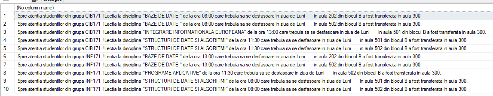
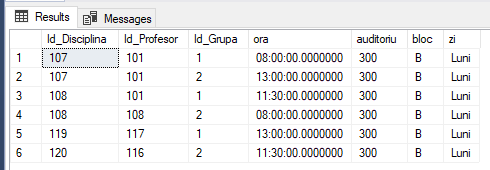
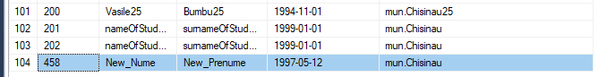
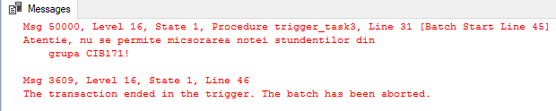
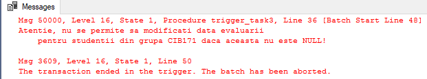
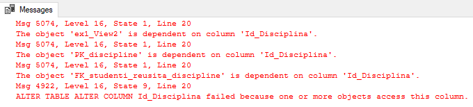
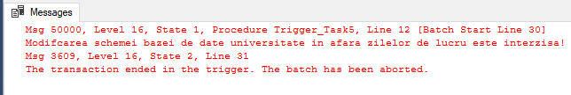
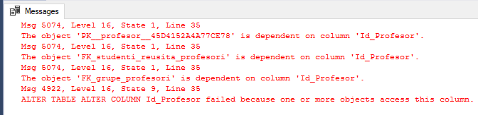
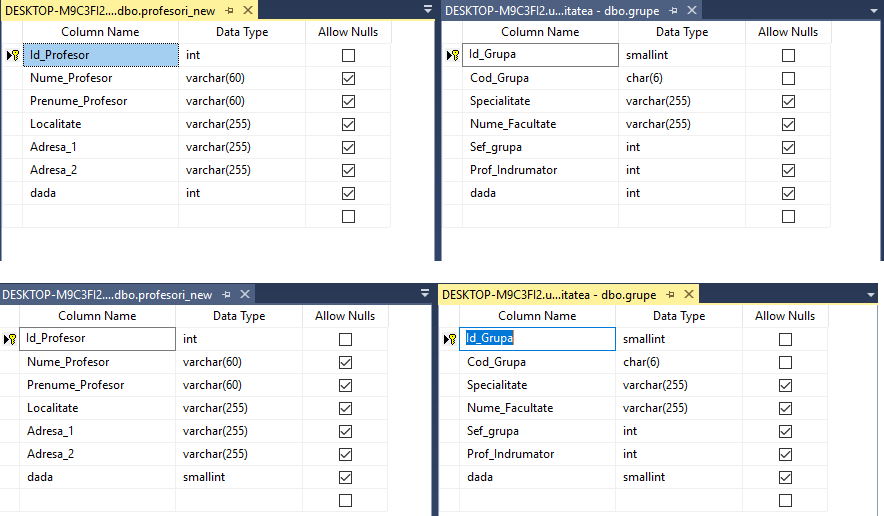

# Laboratory Work 10

## Tasks:
### 1.  Modify the 'inregistrare_noua' trigger, in case of update will show the discipline, ora, Cod_Grupa, Ziua, Blocul,Auditoriul Vechi and Auditoriul Nou.

```sql
USE universitatea
GO
DROP TRIGGER IF EXISTS plan_studii.Trigger_Task1
GO
CREATE TRIGGER plan_studii.Trigger_Task1 on plan_studii.orarul
	AFTER UPDATE
	AS SET NOCOUNT ON
		IF(UPDATE(Auditoriu))
			BEGIN
				SELECT  DISTINCT 'Spre atentia studentilor din grupa ' +
						grupe.Cod_Grupa + '!' +
						'Lectia la disciplina "' + 
						UPPER(discipline.Disciplina) +
						'" de la ora ' +
						CAST(inserted.Ora AS VARCHAR(5)) +
						' care trebuia sa se desfasoare in ziua de ' +
						inserted.Zi +
						' in aula ' +
						CAST(deleted.Auditoriu AS CHAR(3)) +
						' din blocul ' +
						inserted.Bloc +
						' a fost transferata in aula ' + 
						CAST(inserted.Auditoriu AS CHAR(3)) + '.'
				FROM inserted
				JOIN plan_studii.discipline
				ON inserted.Id_Disciplina = discipline.Id_Disciplina
				JOIN deleted
				ON deleted.Id_Disciplina = discipline.Id_Disciplina
				JOIN dbo.grupe
				ON inserted.Id_Grupa = grupe.Id_Grupa
			END
GO

UPDATE plan_studii.orarul
SET Auditoriu = 300
WHERE Zi = 'Luni'
   
```






### 2. Create a trigger, which will populate conscutively tables stundeti and studenti_reusita and will avoid erros according to the keys.

```sql

USE universitatea
GO
DROP TRIGGER IF EXISTS studenti.Trigger_Task2
GO
CREATE TRIGGER studenti.Trigger_Task2 ON studenti.studenti_reusita
INSTEAD OF INSERT
AS
	DECLARE @id_student_inserted INT
	
	SELECT @id_student_inserted = Id_Student FROM inserted
	
	if(@id_student_inserted IN (SELECT Id_Student
								FROM studenti.studenti))
	BEGIN
		INSERT INTO studenti.studenti_reusita
		SELECT * FROM inserted
	END
	ELSE
	BEGIN
		INSERT INTO studenti.studenti
		VALUES (@id_student_inserted, 'New_Nume', 'New_Prenume', '1997-05-12', 'mun.Chisinau')

		INSERT INTO studenti.studenti_reusita
		SELECT * FROM inserted
	END

INSERT INTO studenti.studenti_reusita
VALUES(458, 105, 110, 1, 'Examen', 9, '2018-12-11')
```




### 3. Create a trigger which will does not allow to shrink down the mark in the studenti_reusita table and modifying the values in the Data_Evaluare field, where these are NOT NULLS. It should work only for 'CIB171'. In other case should appear an information message.


```sql

USE universitatea
GO
DROP TRIGGER IF EXISTS studenti.trigger_task3
GO
CREATE TRIGGER studenti.trigger_task3 ON studenti.studenti_reusita
AFTER UPDATE
AS
	DECLARE @grupa CHAR(6)
	DECLARE @nota_original INT
	DECLARE @nota_modified INT
	DECLARE @data_evaluare DATE
	DECLARE @message_nota VARCHAR(500) = CONCAT('Atentie, nu se permite micsorarea notei stundentilor din 
	grupa CIB171!', CHAR(13))
	DECLARE @message_data_evaluare VARCHAR(500) = CONCAT('Atentie, nu se permite sa modificati data evaluarii 
	pentru studentii din grupa CIB171 daca aceasta nu este NULL!', CHAR(13))

	SELECT @nota_original = Nota
	FROM deleted

	SELECT @nota_modified = Nota
	FROM inserted

	SELECT @data_evaluare = Data_Evaluare
	FROM deleted
	
	SELECT @grupa = Cod_Grupa
	FROM inserted
	JOIN dbo.grupe
	ON inserted.Id_Grupa = grupe.Id_Grupa

	IF(@grupa = 'CIB171')
	BEGIN
		IF(UPDATE(Nota) AND @nota_original > @nota_modified)
		BEGIN
			RAISERROR(@message_nota, 16, 1)
			ROLLBACK TRANSACTION
		END
		IF(UPDATE(Data_Evaluare) and @data_evaluare is not null)
		BEGIN
			RAISERROR(@message_data_evaluare, 16, 1)
			ROLLBACK TRANSACTION
		END
	END


UPDATE studenti.studenti_reusita
SET Nota = 6
WHERE Id_Student = 100 AND Id_Disciplina = 107 AND Tip_Evaluare = 'Examen'

UPDATE studenti.studenti_reusita
SET Data_Evaluare = '2018-12-05'
WHERE Id_Student= 100 AND Id_Disciplina = 105 AND Tip_Evaluare = 'Examen'


```





### 4.  Create a trigger DDL which will interdict modification of 'Id_Disicpllina' column in tables of database universitatae with showing the message.

```sql
USE universitatea
GO
DROP TRIGGER IF EXISTS Trigger_Task4 ON DATABASE
GO
CREATE TRIGGER Trigger_Task4 ON DATABASE
FOR ALTER_TABLE
AS
	DECLARE @Column_Modified VARCHAR(20)

	SET @Column_Modified = EVENTDATA().value('(/EVENT_INSTANCE/AlterTableActionList/*/Columns/Name)[1]', 
												'nvarchar(max)')

	IF @Column_Modified = 'Id_Disciplina'
	BEGIN
		RAISERROR ('Modifcarea coloanei Id_Disciplina in tabelele bazei de date universitate este interzisa',
						16, 1)
		ROLLBACK 
	END

ALTER TABLE plan_studii.discipline
ALTER COLUMN Id_Disciplina SMALLINT

```




### 5.  Create a trigger DDL which will interdict modification schema of database over working hours.


```sql

USE universitatea
GO
DROP TRIGGER IF EXISTS Trigger_Task5 ON DATABASE
GO
CREATE TRIGGER Trigger_Task5 ON DATABASE
FOR CREATE_TABLE, ALTER_TABLE, DROP_TABLE
AS
	DECLARE @Time TIME
	DECLARE @Day INT

	SET @Day = DATEPART(WEEKDAY, EVENTDATA().value('(/EVENT_INSTANCE/PostTime)[1]', 'nvarchar(max)'))
	SET @Time = EVENTDATA().value('(/EVENT_INSTANCE/PostTime)[1]', 'nvarchar(max)')

	IF @Day NOT BETWEEN 2 AND 6
	BEGIN
		RAISERROR ('Modifcarea schemei bazei de date universitate in afara zilelor de lucru este interzisa!',
						16, 1)
		ROLLBACK
		RETURN
	END

	IF @Day BETWEEN 2 AND 6 AND @time NOT BETWEEN CAST('08:00' AS TIME) AND CAST('18:00' AS TIME)
	BEGIN
		RAISERROR ('Modifcarea schemei bazei de date universitate in afara orelor de lucru este interzisa!',
						16, 1)
		ROLLBACK
		RETURN
	END

CREATE TABLE dbo.catedre (
	Id_Catedra INT
)

```




### 6. Create a trigger DDL , which once modified properties of 'Id_Profesor' column from one table, will modify automatically in allow tables.

```sql

USE universitatea
GO
DROP TRIGGER IF EXISTS Trigger_Task6 ON DATABASE
GO
CREATE TRIGGER Trigger_Task6 ON DATABASE
FOR alter_table
AS
	DECLARE @column_modified VARCHAR(20)
	DECLARE @command VARCHAR(500)
	DECLARE @command2 VARCHAR(500)
	DECLARE @object VARCHAR(50)
	DECLARE @schema VARCHAR(50)

	SET @command = EVENTDATA().value('(/EVENT_INSTANCE/TSQLCommand/CommandText)[1]', 'nvarchar(max)')


	SET @object = EVENTDATA().value('(/EVENT_INSTANCE/ObjectName)[1]', 'nvarchar(max)')			
									

	SET @column_modified = EVENTDATA().value('(/EVENT_INSTANCE/AlterTableActionList/Alter/Columns/Name)[1]', 
												'nvarchar(max)')

	SET @schema = EVENTDATA().value('(/EVENT_INSTANCE/SchemaName)[1]', 'nvarchar(max)')	
												
	IF @column_modified = 'Id_Profesor'
	BEGIN
		SELECT @command2 = REPLACE(@command, @schema + '.' + @object, 'dbo.profesori_new')
		EXECUTE(@command2)
		SELECT @command2 = REPLACE(@command, @schema + '.' + @object, 'studenti.studenti_reusita')
		EXECUTE(@command2)
		SELECT @command2 = REPLACE(@command, @schema + '.' + @object, 'plan_studii.orarul')
		EXECUTE(@command2)
	END

ALTER TABLE cadre_didactice.profesori
ALTER COLUMN Id_Profesor SMALLINT
```







