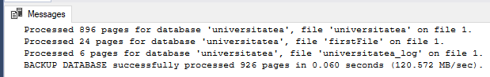
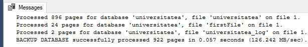
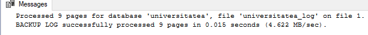
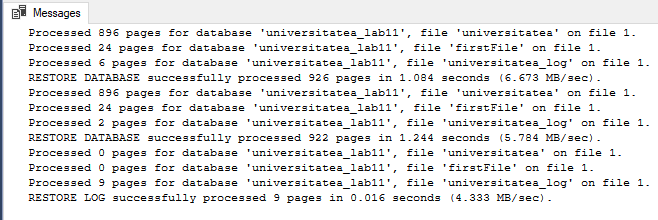

# Laboratory Work 11

## Tasks:
### 1.  Create a folder 'Backup_lab11'. Execute a full backup of database 'universitatea' in this folder. File of restoring must be named exercitiul.bak. Execute SQL instructions.

```sql
USE universitatea
GO
IF EXISTS (SELECT * FROM master.dbo.sysdevices WHERE name='device01')
EXEC sp_dropdevice 'device01' , 'delfile';
GO
EXEC sp_addumpdevice 'DISK', 'device01', 'C:\DB_lab11\Backup_lab11\exercitiul1.bak'
GO
BACKUP DATABASE universitatea
TO device01
WITH FORMAT, 
		NAME = 'universitatea - Full Database Backup'
   
```



### 2. Write SQL instructions for differential backup which will be named exercitiul2.bak.

```sql
USE universitatea
GO
IF EXISTS(SELECT * FROM master.dbo.sysdevices WHERE name='device02')
EXEC sp_dropdevice 'device02', 'delfile'
GO
EXEC sp_addumpdevice 'DISK', 'device02', 'C:\DB_lab11\Backup_lab11\exercitiul2.bak'
GO
BACKUP DATABASE universitatea
TO device02
```




### 3. Write SQL instructions for log backup whici will be named exercitiul3.bak.


```sql
USE universitatea
GO
IF EXISTS(SELECT * FROM master.dbo.sysdevices WHERE name='device03')
EXEC sp_dropdevice 'device03', 'delfile'
GO
EXEC sp_addumpdevice 'DISK', 'device03', 'C:\DB_lab11\Backup_lab11\exercitiul3.bak'
GO
BACKUP LOG universitatea
TO device03
```


### 4.  Execute restoring consecutively of all backup files created. The new databse will be named universitatea_lab11. Files of the new database must be located in 'BD_lab11'. Write the SQL instructions.

```sql
USE universitatea
GO
IF EXISTS(SELECT * FROM master.sys.databases WHERE name='universitatea_lab11')
DROP DATABASE universitatea_lab11
GO
RESTORE DATABASE universitatea_lab11
FROM device01
WITH MOVE 'universitatea' TO 'C:\DB_lab11\Backup_lab11\universitatea_lab11.mdf',
		MOVE 'universitatea_log' TO 'C:\DB_lab11\Backup_lab11\universitatea_lab11_log.ldf',
		MOVE 'firstfile' TO 'C:\DB_lab11\Backup_lab11\universitatea_lab11_firstfile.mdf',
		NORECOVERY
GO
RESTORE DATABASE universitatea_lab11
FROM device02
WITH NORECOVERY
GO
RESTORE DATABASE universitatea_lab11
FROM device03
WITH NORECOVERY
```




