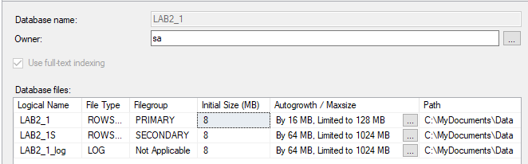
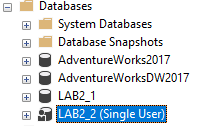
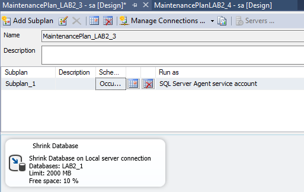
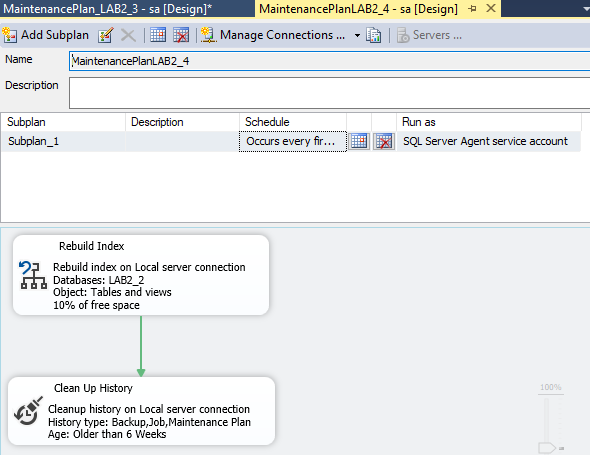

# Laboratory Work 2
## Theory
#### Create a new database
 In order to create a DataBase you should make a right-click on the Databases folder and select "New Database...". A window will appear, allowing you to configure the database before creating it. Give the database a name that will help you identify it. Most users can leave the rest of the settings at their default 

#### Database Maintenance
Database Maintenance is a term we use to describe a set of tasks that are all run with the intention to improve your database. There are routines meant to help performance, free up disk space, check for data errors, check for hardware faults, update internal statistics, and many other obscure (but important) things.

## Exercises
### Exercise nr.1

In exercise 1 was created a simple database **LAB2_1** were was setted up the autogrowth/maximize property, physical file path, and also another filegroup was made. That DataBase was saved in MyDocuments/Data folder as is shown above.

---

 ### Exercise nr.2

In exercise 2 another database **LAB2_2** was created. For this database was setted up Restrict Access -> Single user , that allows only one user at a time to access the database.

---

 ### Exercise nr.3

In exeercise 3 was created a maintenance plan for database **LAB2_1** that shrink the database when its size is 2000 Mb. The released space is returned to the operating system. This process occurs every week on Friday at 12:00:00 AM.

---

 ### Exercise nr.4

In exeercise 4 was created a maintenance plan for database **LAB2_2** that has History Cleanup Task and Rebuild Index Task . It Occurs every first Sunday of every 1 month(s) at 12:00:00 AM
 
