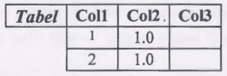
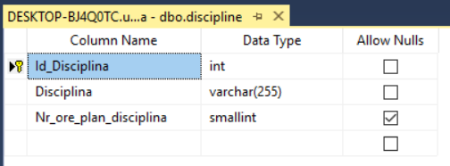
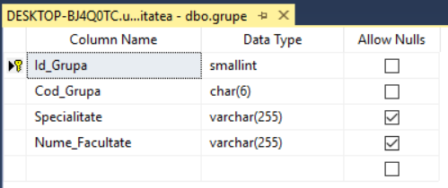
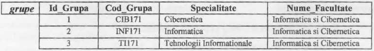
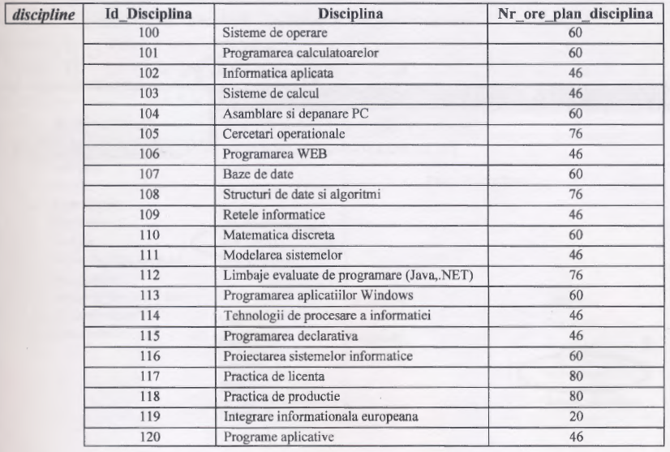
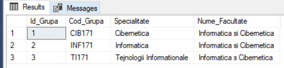
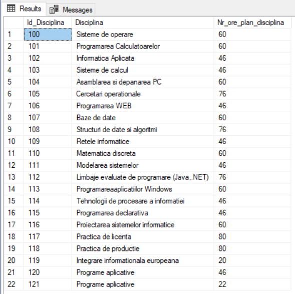

# Laboratory Work 3

## Tasks
##### 1. Which of the numbers below may be in a DECIMAL(4,1) field type?
```
a) 16,2   b)116,2   c)16,21   d)1116,2   e)1116,21
```
##### Answer :  `a) 16,2 , b)116,2`

##### 2. [Col1] from the table is the INT type , and [Col2] is of DECIMAL(2,1). What type should be the [Col3] in order to save the result of the expression [Col1] * [Col2]?


##### Answer :  `[Col3] should be of type float.`

##### 3. Create a university database with default properties. In this database create 2 tables (grupe, discipline), the schemes of which are defined in section 3.3 of the chapter.
##### Task implimentation :




##### 4. Include the following records in the respective tables of the university database:




##### Task implimentation :




