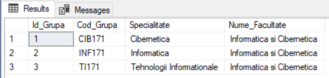
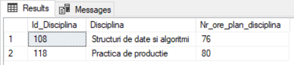
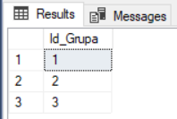

# Laboratory Work 4

## Write SQL queries for following tasks
##### 1. Find information about all study groups from faculty (ex1).
#### Query : 
```
select * from grupe;
```
#### Query result : 


##### 2. Display list of all disciplines which a teached by at least 2 teachers (ex24).
#### Query : 
```
  WITH foo AS (	select Id_Disciplina ,count( distinct Id_Profesor) as numarProfesori from studenti_reusita
	group by Id_Disciplina  having count( distinct Id_Profesor) > 1 )
	select discipline.* from discipline inner join foo on foo.Id_Disciplina = discipline.Id_Disciplina;
```
#### Query result : 


##### 3. In which groups are more than 24 students (ex25).
#### Query : 
```
select Id_Grupa from studenti_reusita 
group by Id_Grupa having count( distinct Id_Student) > 24;
```
#### Query result : 



