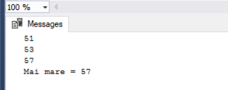
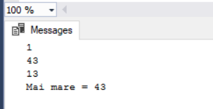

# Laboratory Work 5

## Tasks
### 1. Fill in the following code to display the biggest number of the three numbers shown.


#### Task implementation: 
```
DECLARE @N1 INT, @N2 INT, @N3 INT;
DECLARE @MAI_MARE INT;
SET @N1 = 60 * RAND()
SET @N2 = 60 * RAND()
SET @N3 = 60 * RAND()

IF @N1 > @N2  and @N1 > @N3 
	BEGIN
		SELECT @MAI_MARE = @N1
	END
IF @N2 > @N1  and @N2 > @N3 
	BEGIN
		SELECT @MAI_MARE = @N2
	END
IF @N3 > @N1  and @N3 > @N2 
	BEGIN
		SELECT @MAI_MARE = @N3
	END
PRINT @N1;
PRINT @N2;
PRINT @N3;
PRINT 'Mai mare = ' + CAST(@MAI_MARE AS VARCHAR(2));
```
#### Result : 


### 2. Display the first 10 data (Name, Surname of student) in function of Grade value (except 6 and 8) of student on first evaluation at Database , using IF-ELSE statement. To use variables.
#### Task implementation: 
```
...
```
#### Result : 
...

### 3. Solve the same task,1, using CASE statement.
#### Task implementation: : 
```
DECLARE @N1 INT, @N2 INT, @N3 INT;
DECLARE @MAI_MARE INT;
SET @N1 = 60 * RAND()
SET @N2 = 60 * RAND()
SET @N3 = 60 * RAND()
SELECT @MAI_MARE = 
	CASE 
		WHEN @N1 > @N2  and @N1 > @N3  THEN  @N1
		WHEN @N2 > @N1  and @N2 > @N3  THEN  @N2
		WHEN @N3 > @N1  and @N3 > @N2  THEN  @N3
	END 
PRINT @N1;
PRINT @N2;
PRINT @N3;
PRINT 'Mai mare = ' + CAST(@MAI_MARE AS VARCHAR(2));
```
#### Result : 



### 4. Modify the exercises from task 1 and 2 for including error processing with TRY-CATCH and RAISERROR.
#### Task implementation: : 
```
BEGIN TRY
	DECLARE @N1 INT, @N2 INT, @N3 INT;
	DECLARE @MAI_MARE INT;
	SET @N1 = 60 * RAND()
	SET @N2 = 60 * RAND()
	SET @N3 = 60 * RAND()
	--SET @N1 = 1/0
	SELECT @MAI_MARE = 
		CASE 
			WHEN @N1 > @N2  and @N1 > @N3  THEN  @N1
			WHEN @N2 > @N1  and @N2 > @N3  THEN  @N2
			WHEN @N3 > @N1  and @N3 > @N2  THEN  @N3
		END 
	PRINT @N1;
	PRINT @N2;
	PRINT @N3;
	PRINT 'Mai mare = ' + CAST(@MAI_MARE AS VARCHAR(2));
END TRY
BEGIN CATCH
	DECLARE @EM as varchar(4000) , @ESEV as int , @EST as int;
	SELECT @EM = ERROR_MESSAGE() , @ESEV = ERROR_SEVERITY() , @EST = ERROR_STATE();
	raiserror(@EM,@ESEV,@EST);
END CATCH
```
#### Result : 
