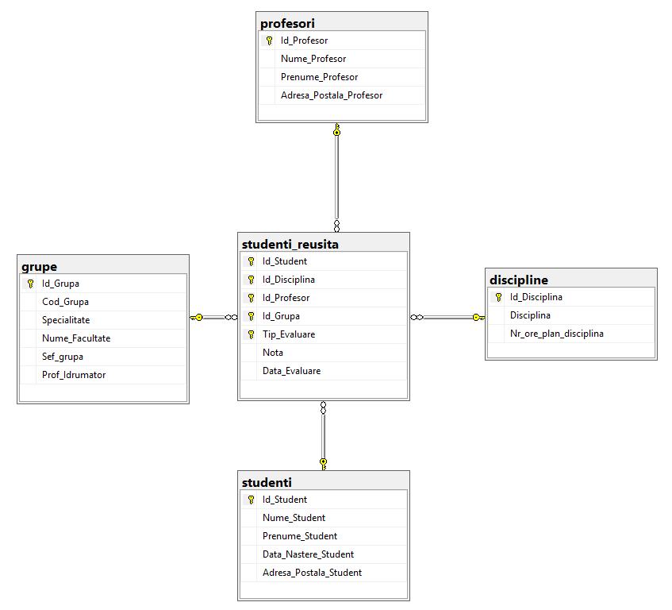
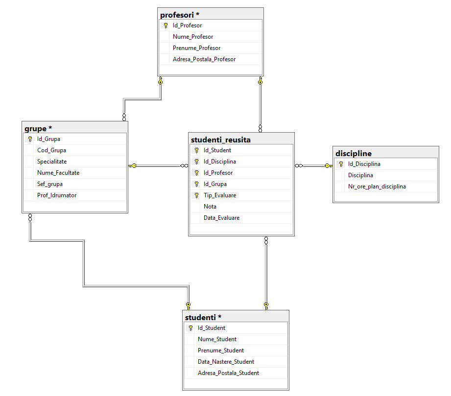
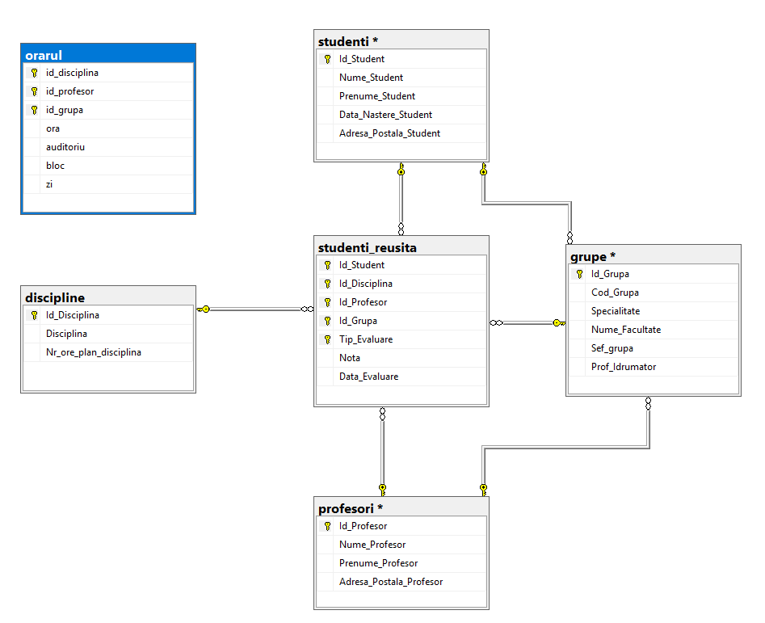
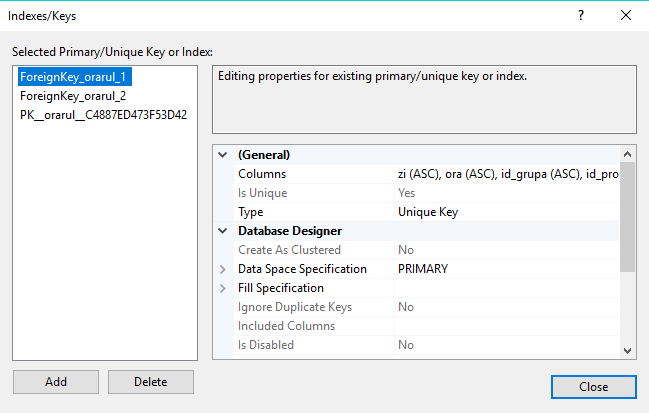
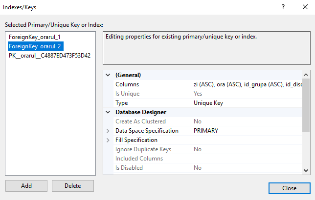
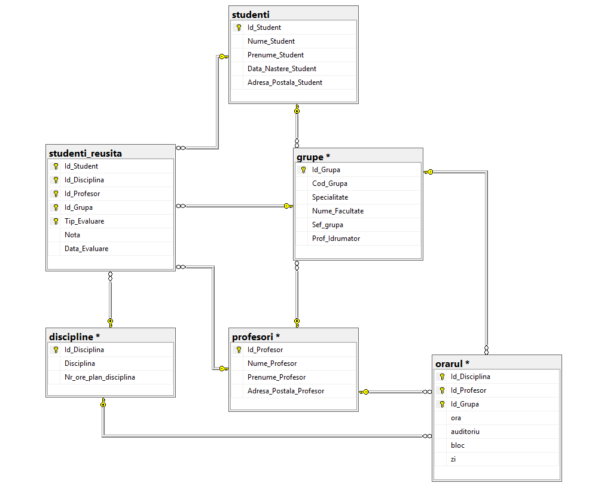
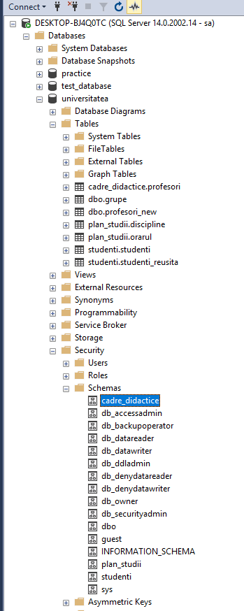

# Laboratory Work 7

## Tasks:
### 1. Create a database diagram , using the standard form of vizualization, structure which is described at the beginning practice items in 4 chapter.




### 2. Add the references constraints ( for studenti and profesori tables) needed 'Sef_Grupa' , 'Prof_Indrumator' columns from grupe table.



### 3. At the performed diagram , should to add **orarul** table. Table **orarul** contains the 'disciplinei' identifier (Id_Disciplina) , profesor's identifier(Id_Profesor) and study block (Bloc). Table key is formed by fields: Id_Grupa, Zi, Ora, Auditoriu.




### 4. **Orarul** table should contains 2 secondary keys: (Zi, Ora, Id_Grupa, Id_Profesor), (Zi, Ora, Id_Grupa, Id_Disciplina).






### 5. In the diagram should be added the PK-FK for Id_Disciplina, Id_Profesor, Id_Grupa attributes from **orarul** table with those attributes from tables.



### 6. Create the new 3 schemas : cadre_didactice, plan_studii, studenti. Transfer profesori from dbo schema to 'cadre_didactice' schema , discipline to 'plan_studii', studenti and studenti_reusita to 'studenti'. Write the needed SQL instructions.

```
USE universitatea
GO
CREATE SCHEMA cadre_didactice AUTHORIZATION dbo;
GO
CREATE SCHEMA plan_studii AUTHORIZATION dbo;
GO
CREATE SCHEMA studenti AUTHORIZATION dbo;
GO
ALTER SCHEMA cadre_didactice TRANSFER dbo.profesori;
GO 
ALTER SCHEMA plan_studii TRANSFER dbo.orarul
GO
ALTER SCHEMA plan_studii TRANSFER dbo.discipline;
GO
ALTER SCHEMA studenti TRANSFER dbo.studenti;
GO
ALTER SCHEMA studenti TRANSFER dbo.studenti_reusita;
```




### 7. Modify the 2-3 queries from chapter 4 on the 'universitatea' database for explicitly addressing at the tables, taking into account that tables are in the new schemas.


```
  WITH foo AS (	select Id_Disciplina ,count( distinct Id_Profesor) as numarProfesori from studenti.studenti_reusita
	group by Id_Disciplina  having count( distinct Id_Profesor) > 1 )
	select plan_studii.discipline.* from plan_studii.discipline inner join foo on foo.Id_Disciplina = plan_studii.discipline.Id_Disciplina;
	
	
	select Id_Grupa from studenti.studenti_reusita 
group by Id_Grupa having count( distinct Id_Student) > 24;
```


### 7. Modify the 2-3 queries from chapter 4 on the 'universitatea' database for explicitly addressing at the tables, taking into account that tables are in the new schemas.


```
  WITH foo AS (	select Id_Disciplina ,count( distinct Id_Profesor) as numarProfesori from studenti.studenti_reusita
	group by Id_Disciplina  having count( distinct Id_Profesor) > 1 )
	select plan_studii.discipline.* from plan_studii.discipline inner join foo on foo.Id_Disciplina = plan_studii.discipline.Id_Disciplina;
	
	
	select Id_Grupa from studenti.studenti_reusita 
group by Id_Grupa having count( distinct Id_Student) > 24;
```

### 8. Create synonyms for simplify the queries performed in the previous item and perform the queries , using the created synonyms.

```
USE universitatea
GO
CREATE SYNONYM synonym_discipline FOR plan_studii.discipline;
GO
CREATE SYNONYM synonym_studenti_reusita FOR studenti.studenti_reusita;

WITH foo 
     AS (SELECT id_disciplina, 
                Count(DISTINCT id_profesor) AS numarProfesori 
         FROM   synonym_studenti_reusita 
         GROUP  BY id_disciplina 
         HAVING Count(DISTINCT id_profesor) > 1) 
SELECT synonym_discipline.* 
FROM   synonym_discipline 
       INNER JOIN foo 
               ON foo.id_disciplina = synonym_discipline.id_disciplina; 

SELECT id_grupa 
FROM   synonym_studenti_reusita 
GROUP  BY id_grupa 
HAVING Count(DISTINCT id_student) > 24; 
```
