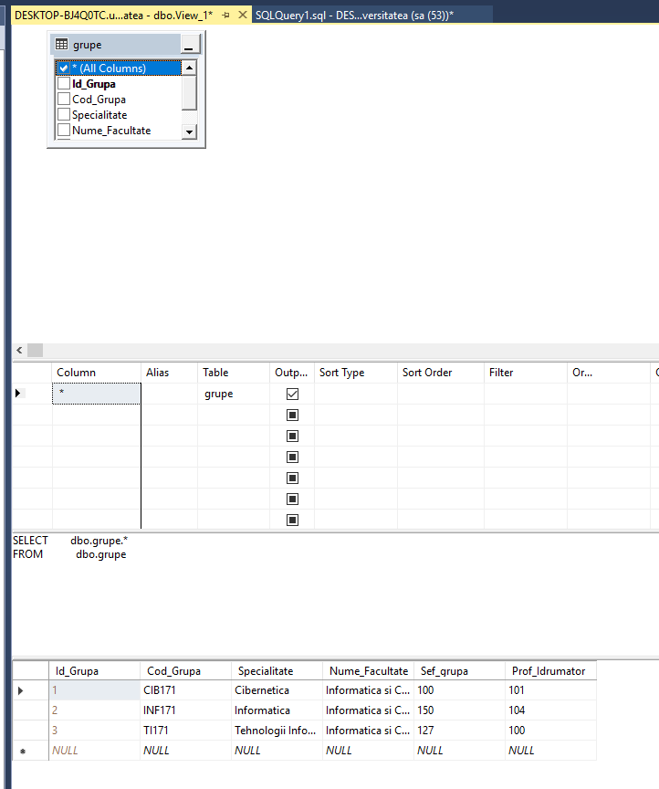

# Laboratory Work 8

## Tasks:
### 1.  Create 2 views based on exercises from 4th laboratory work. One of them should be created using the 'View Designer' and the other using the 'Query Editor'.




```
CREATE VIEW ex1_view2 
AS 
  WITH foo 
       AS (SELECT id_disciplina, 
                  Count(DISTINCT id_profesor) AS numarProfesori 
           FROM   studenti.studenti_reusita 
           GROUP  BY id_disciplina 
           HAVING Count(DISTINCT id_profesor) > 1) 
  SELECT plan_studii.discipline.* 
  FROM   plan_studii.discipline 
         INNER JOIN foo 
                 ON foo.id_disciplina = plan_studii.discipline.id_disciplina; 
   
```


### 2.  Write an example of INSERT, UPDATE and DELETE instruction on the created views. Leave some comments about the obtained results.

```
INSERT INTO ex1_View1 ( Cod_Grupa, Specialitate, Nume_Facultate, Sef_grupa, Prof_Idrumator)
VALUES ('FAF-161','IT','FCIM',110,105);


UPDATE ex1_View1
SET Specialitate = 'Information Technology'
WHERE Id_Grupa = 4;

DELETE FROM ex1_View1 WHERE Id_Grupa = 4;
```


### 3.  Write the SQL instructions which will modify the created views so that, there will not be possible to modify or delete the tables on which views are defined. Also the views should not accept DML operations in case that conditions under WHERE clause are not respected.


```
alter view ex1_View1
with Schemabinding as 
( 
select Id_Grupa, Cod_Grupa, Specialitate, Nume_Facultate, Sef_grupa, Prof_Idrumator from dbo.grupe 
)
with check option

alter view ex1_View2
with Schemabinding as 
  WITH foo 
       AS (SELECT id_disciplina, 
                  Count(DISTINCT id_profesor) AS numarProfesori 
           FROM   studenti.studenti_reusita 
           GROUP  BY id_disciplina 
           HAVING Count(DISTINCT id_profesor) > 1) 
  SELECT plan_studii.discipline.Id_Disciplina,plan_studii.discipline.Disciplina,plan_studii.discipline.Nr_ore_plan_disciplina
  FROM   plan_studii.discipline 
         INNER JOIN foo 
                 ON foo.id_disciplina =
 plan_studii.discipline.id_disciplina
with check option
```


### 4.  Write the instructions which will test the properties added in 3rd task.


```
--The attempted insert or update failed because the target view either specifies WITH CHECK OPTION or spans a view that specifies WITH CHECK OPTION and one or more rows resulting from the operation did not qualify under the CHECK OPTION constraint.
INSERT INTO ex1_View2 (Id_Disciplina, Disciplina, Nr_ore_plan_disciplina)
VALUES (222,'dadada',22)
```

### 5.  Rewrite 2 queries from the 4th laboratory work so that the subqueries will be represented as commont table expressions.


```
with CTE1 as 
(select Id_Grupa, Cod_Grupa, Specialitate, Nume_Facultate, Sef_grupa, Prof_Idrumator from dbo.grupe )
select * from CTE1

with CTE2 as 
(  
select Nume_Student, Prenume_Student from studenti.studenti
where Id_Student NOT IN ( select Id_Student from studenti.studenti_reusita where Nota > 4 and Tip_Evaluare = 'Reusita curenta' )
)
select * from CTE2
```


### 6. There is a graph presented in the figure below. There is a need in traversing it from node 3 to node 0. Represent the graph traversal using the recursive common table expression.

```
USE universitatea

DECLARE @graph TABLE
(
	Current_Node SMALLINT,
	Next_Node SMALLINT
)

INSERT @graph
SELECT 0, NULL
UNION ALL
SELECT 5, 0
UNION ALL
SELECT 1, 0
UNION ALL
SELECT 2, 1
UNION ALL
SELECT 3, 2
UNION ALL
SELECT 4, 2;

WITH CTE_Graph AS(
	SELECT *
	FROM @graph
	WHERE Current_Node = 3
	UNION ALL
	SELECT graph.*
	FROM @graph AS graph
	INNER JOIN CTE_Graph
	ON graph.Current_Node = CTE_Graph.Next_Node
)

SELECT *
FROM CTE_Graph
```
